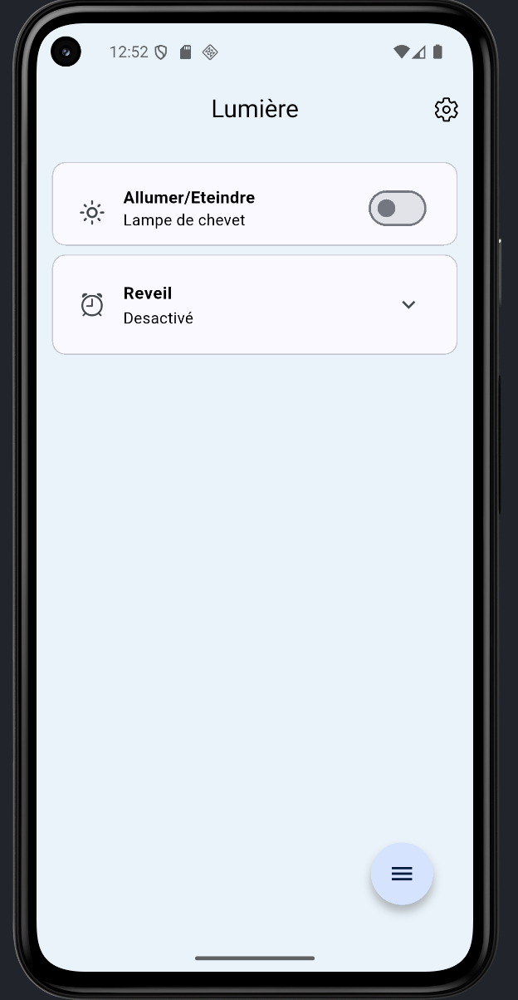

# Lumiere

Application pour contrôler une lampe connecté

## Objectives

This apps aims to control adressable LED projects. The projects can be connected using bluetooth to the phone, and then allows multiple controls such as light level or color.
The first integration of it is with a small bedside lamp, used as an alarm to wake up with a "rising sun" effect.

## Packages

Go checkout packages used in the app:

- [Flutter speed dial](https://github.com/darioielardi/flutter_speed_dial/), for a better floating action button
- [Interactive slider](https://github.com/jonas-zebari/interactive_slider)
- [Ionicons](https://ionic.io/ionicons)

## Branch

This branch is only for the App development.

## To do

The list of everything to do :
- Bluetooth integration
- Communication between the app and an esp32
- Different languages
